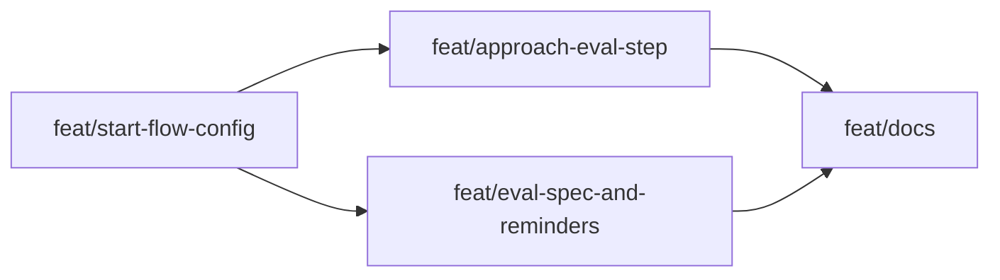

# Approach: build-on-ai-aware

## Strategy

Deliver in four partitions: (1) Start flow and config foundation so the gate and eval status are asked and persisted; (2) Approach instruction changes so initiatives get the placement question and eval step; (3) Eval spec flow (template + instruction) and tweak/bug reminder in parallel with (2); (4) Integration and docs after (1)–(3). No new scripts for MVP; all changes are emergence instruction modules and one new template. Sequential where one partition depends on config or flow; parallel where partitions touch different files.

## Partitions (Feature Branches)

### Partition 1: Start flow and config → `feat/start-flow-config`
**Modules**: `emergence`
**Scope**: Update `emergence/start-flow.md` to add the "Building on AI? (yes/no)" step after draft folder and, when yes, "Eval status (already have / will do)". Document that the agent writes `building_on_ai` and `eval_status` to `emergence-config.json` in the draft folder. Ensure Clarify, Tweak, and Bug Fix entry points run the updated start flow (they reference start-flow; verify step order for tweaks/bugs: Name → Draft folder → Building on AI? → PR preference). No new scripts; schema is additive (backward compatible).
**Dependencies**: None

#### Implementation Steps
1. Edit `emergence/start-flow.md`: insert new step after "Create draft folder", before "Requirements source" (initiatives) or "PR preference" (tweaks/bugs). Use exact copy from UX (gate + eval status).
2. Document in start-flow that the agent must write `building_on_ai` (boolean) and, when true, `eval_status` ("already_have" | "will_do") to `.cicadas/drafts/{name}/emergence-config.json`, merging with existing keys (e.g. `pace`).
3. Verify in clarify.md, tweak.md, bug-fix.md that they run the full start flow; confirm scoping table includes the new step for all three types.
4. Document extended config schema (e.g. in SKILL or tech-design) if not already present.

---

### Partition 2: Approach eval placement → `feat/approach-eval-step`
**Modules**: `emergence`
**Scope**: Update `emergence/approach.md` so that after Lifecycle Check and Ingest, the agent reads `emergence-config.json`; if `building_on_ai` and `eval_status === "will_do"`, ask placement (before build / in parallel), show parallel warning per UX copy, write `eval_placement` to config, and when drafting `approach.md` include an explicit "Eval" step in the sequence. Initiatives only; tweaks/bugs have no Approach.
**Dependencies**: Partition 1 (config and start flow must exist so `emergence-config.json` can contain the keys)

#### Implementation Steps
1. Edit `emergence/approach.md`: add a step after Ingest to read `emergence-config.json` from `drafts/{initiative}/` (or active if post-kickoff).
2. If `building_on_ai` and `eval_status == "will_do"`, ask: "Do you want to insert the (manual) eval step before starting the build, or run evals in parallel with the build? (before / parallel)". If user chooses parallel, show warning and suggestion to wait. Write `eval_placement` ("before_build" | "parallel") to `emergence-config.json`.
3. When drafting the approach document, if eval placement was set, add an explicit "Eval" step (e.g. in Strategy or a short "Eval step" subsection) with wording that reflects before_build vs parallel.
4. Reference approach template if a standard subsection for eval step is added; otherwise embed the step in Strategy or Sequencing.

---

### Partition 3: Eval spec flow and tweak/bug reminder → `feat/eval-spec-and-reminders`
**Modules**: `emergence`, `templates`
**Scope**: Add `emergence/eval-spec.md` instruction module and `templates/eval-spec.md` (derive from reqt-template). Eval-spec module: when to run (after PRD/UX/Tech, when eval_status === "will_do", user accepted offer), template path, playbook path, output path `drafts/{initiative}/eval-spec.md`, six-step playbook summary. Initiatives only. Also update `emergence/tweak.md` and `emergence/bug-fix.md`: when drafting tweaklet/buglet, if `building_on_ai` and `eval_status === "will_do"`, offer to add eval/benchmark reminder (one task or section) per UX copy; do not offer full eval spec.
**Dependencies**: None (can run in parallel with 1 and 2)

#### Implementation Steps
1. Add `templates/eval-spec.md`: structure from reqt-template (problem, use case, hypothesis, scope, success criteria, metrics, data, methodology, model/resources, harness, timeline, results, exit criteria, wrap-up). Self-contained in skill.
2. Add `emergence/eval-spec.md`: instruction module stating it runs only for initiatives after PRD/UX/Tech when eval_status === "will_do" and user accepted offer; reference template path and playbook path (draft or skill); output to `drafts/{initiative}/eval-spec.md`; summarize six-step playbook for agent guidance.
3. Edit `emergence/tweak.md`: when drafting tweaklet, if config has building_on_ai and eval_status === "will_do", offer to add eval/benchmark reminder (exact copy from UX). Do not offer full eval spec.
4. Edit `emergence/bug-fix.md`: when drafting buglet, same as tweak — offer reminder per UX; no full eval spec.

---

### Partition 4: Integration and docs → `feat/docs`
**Modules**: `src/cicadas` (SKILL, README), project root (HOW-TO, CLAUDE if needed)
**Scope**: Update SKILL.md (and HOW-TO, README as needed) to describe the Building on AI flow: gate and eval status for all types; eval spec offer and placement (initiatives only); light touch for tweaks and bug fixes. Ensure optional eval-spec.md and config keys are documented. No script changes unless we add an optional config writer.
**Dependencies**: Partitions 1, 2, 3 (docs reflect implemented behavior)

#### Implementation Steps
1. Update SKILL.md: add subsection or bullets for Building on AI (start flow gate, eval status, eval spec offer, placement, tweak/bug reminder). Reference emergence-config.json keys where relevant.
2. Update HOW-TO.md and/or README if they describe emergence or start flow; add a short note on Building on AI and evals.
3. If CLAUDE.md or implementation.md reference start flow or emergence, add a line on the new step and config.
4. Verify consistency-check or other docs that reference emergence artifacts are aware of optional eval-spec.md.

---

## Sequencing

- Partition 1 (start-flow-config) is the foundation; Partitions 2 and 3 can run after 1. Partition 2 depends on 1 (approach reads config). Partition 3 has no dependency on 2. Partition 4 runs after 1, 2, and 3.



### Partitions DAG

```yaml partitions
- name: feat/start-flow-config
  modules: [emergence]
  depends_on: []

- name: feat/approach-eval-step
  modules: [emergence]
  depends_on: [feat/start-flow-config]

- name: feat/eval-spec-and-reminders
  modules: [emergence, templates]
  depends_on: []

- name: feat/docs
  modules: [emergence]
  depends_on: [feat/start-flow-config, feat/approach-eval-step, feat/eval-spec-and-reminders]
```

## Migrations & Compat

- No data migrations. Existing projects without `building_on_ai` or `eval_status` in emergence-config.json are treated as non–Building-on-AI (backward compatible). Additive only.

## Risks & Mitigations

| Risk | Mitigation |
|------|------------|
| Agent overwrites or corrupts emergence-config.json when writing new keys | Document merge semantics; instruct agent to read, update keys, write. Optional: add small script to set only building_on_ai and eval_status. |
| Playbook PDF too large for context | Reference extracted Markdown in skill for MVP or document path in draft; instruction module summarizes six steps. |
| Tweak/bug reminder copy drifts from UX | Keep exact copy in emergence/tweak.md and bug-fix.md; reference UX doc in instructions. |

## Alternatives Considered

- **Single partition:** Rejected so that start flow and config can land first and approach/eval-spec/tweak-bug can be validated in parallel or sequence.
- **Script to write config:** Deferred to MVP; agent edits JSON with merge semantics. Script can be added later without changing instruction flow.
