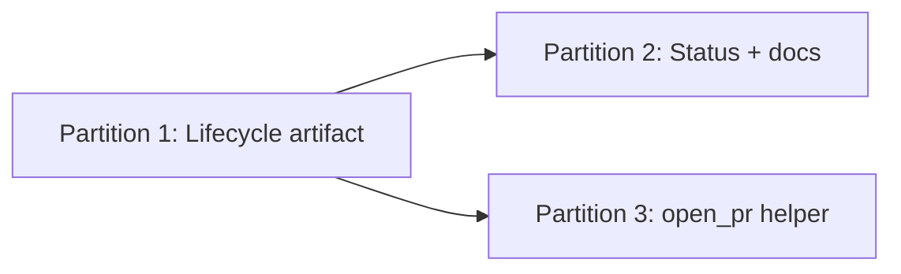

# Approach: Lifecycle and Pull Requests

## Strategy

Deliver in three partitions: (1) lifecycle artifact and integration with kickoff/archive, (2) status/merge detection and documentation/SKILL updates, (3) optional open-PR helper. Partition 1 is blocking for 2 (status needs lifecycle to exist); 2 and 3 can overlap or 3 follow 2. All work stays within the existing scripts and .cicadas layout; no new product UI.

## Partitions (Feature Branches)

### Partition 1: Lifecycle artifact → `feat/lifecycle-artifact`
**Modules:** `src/cicadas/scripts/` (kickoff, archive, utils), `src/cicadas/templates/` (optional default lifecycle template), `.cicadas/drafts/`, `.cicadas/active/`
**Scope:** Define lifecycle.json schema and default template; add approach-phase flow (prompt for “use PRs?” and four boundaries, write lifecycle.json into drafts); update kickoff.py to copy lifecycle.json from drafts to active; update archive.py to include lifecycle.json in archived specs. No change to status or docs yet.
**Dependencies:** None

#### Implementation Steps
1. Add lifecycle.json schema (and document in tech-design / code comment or small doc).
2. Add default lifecycle template (e.g. JSON or generated from template) used when creating lifecycle from approach-phase answers.
3. Implement approach-phase prompts and lifecycle file creation (agent instructions or small script that writes lifecycle.json to drafts/{name}/).
4. Modify kickoff.py: after copying draft specs to active, copy lifecycle.json if present.
5. Modify archive.py: when archiving active/{name}, include lifecycle.json in archive directory if present.
6. Tests for kickoff and archive with lifecycle.json.

### Partition 2: Status, merge detection, and docs → `feat/status-and-docs`
**Modules:** `src/cicadas/scripts/status.py`, `src/cicadas/SKILL.md`, `README.md`, `HOW-TO.md`, `CLAUDE.md`, `.cicadas/` (lifecycle read path)
**Scope:** Extend status (or add optional behavior) to run git fetch and determine “branch X merged into Y” for registered feature and initiative branches; read active lifecycle if present and output “Next: [step name].” Update SKILL.md, HOW-TO.md, and CLAUDE.md to describe lifecycle, PR boundaries, host-agnostic open PR, and git-based completion detection. Ensure “Complete feature” and “Complete initiative” reference PR and lifecycle where relevant.
**Dependencies:** Partition 1 (lifecycle must exist and be promotable so status can read it from active).

#### Implementation Steps
1. Implement merge detection: git fetch, then for each registered branch pair (feat → initiative, initiative → default) check if source is merged into target (e.g. merge-base or branch --merged).
2. Integrate into status.py: when lifecycle.json exists in active for current initiative, compute next step from merge state + lifecycle steps; append “Next: …” (and optional “feat/X → initiative/Y: merged” lines) to status output.
3. Update SKILL.md: add lifecycle and PR boundaries (approach-phase questions, lifecycle as process script, “what’s next”); update Complete feature / Complete initiative to “open PR if enabled, then merge” and reference lifecycle; add host-agnostic open PR and completion detection.
4. Update HOW-TO.md and CLAUDE.md: mention lifecycle.json, PR boundaries, and where to find “next step” and merge status.
5. Tests for status with lifecycle and merge detection (e.g. mock or real git repo with merged branches).

### Partition 3: Optional open-PR helper → `feat/open-pr-helper`
**Modules:** `src/cicadas/scripts/open_pr.py` (new), `src/cicadas/SKILL.md`, `HOW-TO.md`
**Scope:** Optional script open_pr.py that tries gh → glab → Bitbucket URL → fallback message; document in SKILL and HOW-TO. No change to core kickoff/archive/status behavior.
**Dependencies:** None (can run in parallel with 2 or after). Partition 2 docs can already describe “open in UI” and “optional helper”; this partition adds the helper and its doc references.

#### Implementation Steps
1. Add open_pr.py: detect gh/glab in PATH; if present, run with current branch and configurable base; else if Bitbucket remote, print new-PR URL; else print fallback message. Use get_project_root and get_default_branch from utils where relevant.
2. Document in SKILL and HOW-TO: when to use open_pr (lifecycle step “open PR”), how it behaves on each host, and fallback.
3. Tests for open_pr: mock or skip when gh/glab not present; test fallback message and Bitbucket URL when remote is Bitbucket.

## Sequencing

Partition 1 first (lifecycle artifact and kickoff/archive). Partition 2 and 3 can run in parallel after 1, or 3 after 2.

## Migrations & Compat

- No migration of existing initiatives; existing drafts/active without lifecycle.json continue to work. kickoff and archive only copy lifecycle.json when present.
- Registry and config.json unchanged; no backfill required.

## Risks & Mitigations

| Risk | Mitigation |
|------|-------------|
| status.py becomes heavy | Keep merge detection behind optional flag or only when lifecycle.json present; minimal new code. |
| Approach-phase flow unclear | Document in EMERGENCE or approach subagent when to ask PR questions and how to write lifecycle.json. |
| open_pr brittle on some hosts | Helper is optional; fallback is always “push and open in UI.” |

## Alternatives Considered

- **Lifecycle in config.json:** Rejected; config is project-wide, lifecycle is per-initiative.
- **Host API for merge detection:** Rejected; git-only keeps Cicadas portable and avoids API keys.
- **Mandatory open_pr script:** Rejected; optional best-effort and clear docs are sufficient.

---

_Copyright 2026 Cicadas Contributors_
_SPDX-License-Identifier: Apache-2.0_
