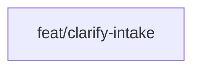

# Approach: visual-requirements

## Strategy

Single, sequential partition. All work is instruction changes in the Emergence layer (clarify.md; optional EMERGENCE.md/SKILL.md). No script changes, no parallel feature branches. One feature branch suffices: implement the intake step (already drafted in clarify.md), verify behavior, then optionally add discoverability docs.

## Partitions (Feature Branches)

### Partition 1: Clarify intake → `feat/clarify-intake`

**Modules**: `src/cicadas/emergence/`
**Scope**: Ensure Clarify subagent implements the full intake flow (Q/D/L), Loom instructions, Doc path, and fill-from-file behavior; optionally document file conventions in EMERGENCE.md or SKILL.md.
**Dependencies**: None

#### Implementation Steps

1. Confirm `clarify.md` contains step 0.5 Intake with exact copy from UX/PRD (intake question, [Q][D][L], Loom instructions block, Doc path, wait-for-file behavior, fill-from-doc/loom).
2. Dry-run or manual test: run Clarify for a test initiative; exercise [Q] (unchanged), [D] (place requirements.md, confirm, verify PRD fill), [L] (place loom.md, confirm, verify PRD fill).
3. Optional: Add a short subsection or line to `EMERGENCE.md` and/or `SKILL.md` documenting that Builders can provide requirements via Loom (transcript in `drafts/{initiative}/loom.md`) or a doc (`drafts/{initiative}/requirements.md`).
4. Optional: Add a test (e.g. in tests/) that parses `clarify.md` and asserts presence of "Intake", "loom.md", and "requirements.md" to guard against regressions.

## Sequencing

Single partition; no parallelism. No DAG needed for parallel worktrees.



### Partitions DAG

> Single partition; sequential execution. Omit parallel worktree semantics.

```yaml partitions
- name: feat/clarify-intake
  modules: [src/cicadas/emergence]
  depends_on: []
```

## Migrations & Compat

Not applicable. No data model or script behavior change. Existing initiatives and drafts are unaffected. Builders who do not use the new intake options see one extra question (intake choice) and can choose [Q] for current behavior.

## Risks & Mitigations

| Risk | Mitigation |
|------|------------|
| Agent skips "wait for file" and proceeds without loom.md/requirements.md | Instructions in clarify.md explicitly say "Reply here once loom.md is in place" and "confirm when the file is in place"; agent must not assume content if file is missing. |
| Instruction drift (copy changes and becomes inconsistent with UX/PRD) | Use exact copy from UX doc; optional test that greps clarify.md for key strings. |
| Builders don't discover loom.md / requirements.md | Optional EMERGENCE.md and SKILL.md mention; Clarify prompt already explains options when they run it. |

## Alternatives Considered

- **New script to "ingest" loom.md:** Rejected; agent already runs Clarify and can read the file. Adding a script would duplicate logic and require agent–script coordination (ADR-1).
- **Multiple partitions (e.g. clarify + docs):** Rejected; the optional doc update is a few lines and fits naturally in the same branch. Splitting would add process overhead with no parallel benefit.
- **Loom API integration in MVP:** Rejected; manual copy-paste keeps scope minimal and avoids auth/rate limits (ADR-3).
