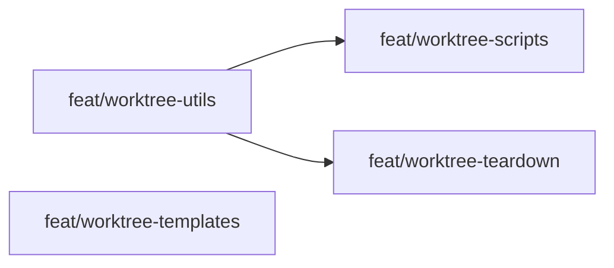

# Approach: Worktrees for Parallel Execution

## Strategy

Three partitions of work cut along the same boundary as the implementation sequence in the tech design:

1. **Foundation** — `utils.py` extensions (worktree utilities + DAG parser). Blocks everything else; must land first.
2. **Core Scripts** — `branch.py`, `kickoff.py`, `check.py`. Depends on Foundation; these three can themselves execute in parallel since they touch distinct files.
3. **Teardown & Status** — `archive.py`, `prune.py`, `abort.py`, `status.py`. Depends on Foundation; can run in parallel with Core Scripts after Foundation lands.

A fourth non-code partition covers templates and emergence instruction updates; it is independent of all code changes and can be authored any time.

## Partitions (Feature Branches)

### Partition 1: Foundation Utilities → `feat/worktree-utils`
**Modules**: `src/cicadas/scripts/utils.py`, `tests/`
**Scope**: All new shared logic in `utils.py` and its unit tests. This is the only blocking dependency in the initiative. Nothing else can be implemented until this lands.
- `git_version_check()`
- `worktree_path(repo_root, branch_name) -> Path`
- `parse_partitions_dag(approach_path) -> list[dict]`
- `create_worktree(repo_root, branch_name, worktree_dir) -> Path`
- `remove_worktree(repo_root, worktree_dir, force=False)`
- `WorktreeDirtyError` exception class
- Full unit test coverage for all above (real temp git repos, no mocks)
**Dependencies**: None — runs immediately.

#### Implementation Steps
1. Add `git_version_check()` — subprocess `git --version`, parse semver, raise `RuntimeError` if < 2.5
2. Add `worktree_path()` — deterministic slug computation, `pathlib.Path` construction
3. Add `parse_partitions_dag()` — regex extraction of fenced `yaml partitions` block, `PyYAML` parse, graceful `[]` fallback on any failure
4. Add `create_worktree()` — `git worktree add`, idempotency check on existing path
5. Add `remove_worktree()` + `WorktreeDirtyError` — `git worktree remove [--force]`, missing-dir graceful path
6. Add `pyyaml` to `pyproject.toml` dependencies
7. Write unit tests for all functions (temp git repos)

---

### Partition 2: Core Script Integration → `feat/worktree-scripts`
**Modules**: `src/cicadas/scripts/branch.py`, `src/cicadas/scripts/kickoff.py`, `src/cicadas/scripts/check.py`, `tests/`
**Scope**: All user-facing logic changes to the three primary scripts that implement the parallel-execution workflow.
**Dependencies**: Requires Partition 1 (`feat/worktree-utils` merged to `initiative/worktrees-parallel-execution`).

#### Implementation Steps
1. **`branch.py`**: Import `parse_partitions_dag`, `create_worktree`, `worktree_path` from `utils`. Look up partition in DAG; if `depends_on: []`, call `create_worktree`; else plain branch. Record `worktree_path` in registry. Write `context.md` to worktree root. Add `--worktree-dir` and `--no-worktree` args.
2. **`kickoff.py`**: After draft promotion, call `parse_partitions_dag` on promoted `approach.md`. If any partition has `depends_on: []`, call `check_conflicts(initiative_name=name)`. Print parallel partition summary.
3. **`check.py`**: Add `initiative_name: str | None = None` param to `check_conflicts()`. When set, scope conflict check to all branches registered to that initiative. Add stale-worktree detection: iterate `registry["branches"]`, flag any `worktree_path` whose directory is absent. Return `bool` (has conflicts).
4. Write integration tests for all three scripts (real temp git repos with `approach.md` fixtures)

---

### Partition 3: Teardown & Status → `feat/worktree-teardown`
**Modules**: `src/cicadas/scripts/archive.py`, `src/cicadas/scripts/prune.py`, `src/cicadas/scripts/abort.py`, `src/cicadas/scripts/status.py`, `tests/`
**Scope**: All worktree cleanup and visibility changes. Independent of Partition 2 (both depend only on Partition 1).
**Dependencies**: Requires Partition 1 (`feat/worktree-utils` merged to `initiative/worktrees-parallel-execution`).

#### Implementation Steps
1. **`archive.py`**: Before deregistering, check `registry["branches"][name].get("worktree_path")`. If set, call `remove_worktree()`. Handle `WorktreeDirtyError` → print `[WARN]`, exit non-zero. Add `--force` arg.
2. **`prune.py`**: Same teardown pattern as `archive.py`.
3. **`abort.py`**: Same teardown pattern; respect `--force`.
4. **`status.py`**: After the existing Branches section, add a Worktrees section. Iterate branches with `worktree_path` set; for each run `git -C {path} status --porcelain` and `git -C {path} log -1 --oneline`. Print path, dirty/clean, HEAD. If directory missing: print `[MISSING]`. Omit section entirely if no worktrees recorded.
5. Write integration tests for archive/prune teardown (dirty + clean + missing dir scenarios) and status rendering

---

### Partition 4: Templates & Emergence Instructions → `feat/worktree-templates`
**Modules**: `src/cicadas/templates/approach.md`, `src/cicadas/emergence/approach.md`, `.gitignore`
**Scope**: Non-code changes — template updates and emergence agent instruction updates. Fully independent.
**Dependencies**: None — can run in parallel with any other partition.

#### Implementation Steps
1. Update `src/cicadas/templates/approach.md`: add the `partitions` YAML block with schema comment and a worked example
2. Update `src/cicadas/emergence/approach.md`: instruct the emergence agent to populate the `partitions` block, explain `depends_on` semantics, show example YAML
3. Add `context.md` to root `.gitignore`

---

## Sequencing

```yaml partitions
- name: feat/worktree-utils
  modules: [src/cicadas/scripts/utils.py, tests/]
  depends_on: []
- name: feat/worktree-scripts
  modules: [src/cicadas/scripts/branch.py, src/cicadas/scripts/kickoff.py, src/cicadas/scripts/check.py, tests/]
  depends_on: [feat/worktree-utils]
- name: feat/worktree-teardown
  modules: [src/cicadas/scripts/archive.py, src/cicadas/scripts/prune.py, src/cicadas/scripts/abort.py, src/cicadas/scripts/status.py, tests/]
  depends_on: [feat/worktree-utils]
- name: feat/worktree-templates
  modules: [src/cicadas/templates/approach.md, src/cicadas/emergence/approach.md, .gitignore]
  depends_on: []
```



- `feat/worktree-utils` and `feat/worktree-templates` start immediately (parallel).
- `feat/worktree-scripts` and `feat/worktree-teardown` start after `feat/worktree-utils` merges to the initiative branch.
- `feat/worktree-scripts` and `feat/worktree-teardown` can run in parallel with each other.

## Migrations & Compat

- **`registry.json`**: Purely additive — `worktree_path` field. Existing entries without it are treated as `null`. No migration script needed.
- **`check.py` signature**: `initiative_name` is an optional keyword arg with default `None`; existing CLI and callers unaffected.
- **`approach.md` template**: New `partitions` block is optional at runtime (absence = all sequential). Existing projects with `approach.md` files lack the block and continue to work unchanged.
- **`--force` on teardown scripts**: All new optional args; existing invocations unchanged.

## Risks & Mitigations

| Risk | Mitigation |
|------|------------|
| `parse_partitions_dag()` regex fails to match emergence agent output | Validate regex against a real emergence `approach.md` in Partition 1; add test fixture from this very initiative's `approach.md` |
| `git worktree add` leaves partial state if interrupted | `create_worktree()` wraps in try/finally; on failure, attempt `git worktree prune` as cleanup before exiting |
| Partition 2 and 3 ship out of order, breaking teardown before creation | Both depend on Partition 1 only; merge order of 2 vs 3 into initiative branch doesn't matter since they touch disjoint files |
| PyYAML not installed in user environments | `pyyaml` added to `pyproject.toml`; `install.sh` uses `pip install -e .` so it's covered |

## Alternatives Considered

- **Single large partition**: Simpler, but would block the entire initiative on the slowest piece. Splitting at the `utils.py` dependency boundary enables true parallel execution for most of the work.
- **`worktree.py` as a separate script**: Rejected (ADR-1) — would require Builder to run two commands per parallel partition and risk registry desync.
