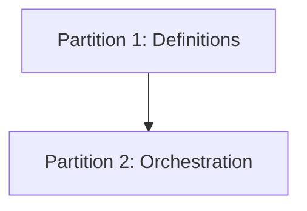

# Approach: bugs-and-tweaks

## Strategy
Sequential. We will first establish the new lightweight standards (skill definitions, templates, and sub-skills) to define the target state, and then update the Python orchestrator scripts to support and enforce these new paths.

## Partitions (Feature Branches)

### Partition 1: Definitions → `feat/definitions`
**Modules**: `src/cicadas/skill.md`, `src/cicadas/templates/`, `src/cicadas/emergence/`
**Scope**: Formally define the lightweight paths in the agent manual and create the supporting templates and sub-skills.
**Dependencies**: None

#### Implementation Steps
1. Update `src/cicadas/skill.md` with lightweight path rules and escalation criteria.
2. Create `src/cicadas/templates/buglet.md`.
3. Create `src/cicadas/templates/tweaklet.md`.
4. Create `src/cicadas/emergence/bug-fix.md`.
5. Create `src/cicadas/emergence/tweak.md`.

### Partition 2: Orchestration → `feat/orchestration`
**Modules**: `src/cicadas/scripts/`
**Scope**: Modify the project lifecycle scripts to handle single-branch workflows and relaxed document validation.
**Dependencies**: Partition 1 (requires the new templates and skill definitions to be in place).

#### Implementation Steps
1. Update `kickoff.py` to allow promoting buglets/tweaklets with reduced artifact sets.
2. Update `branch.py` to allow branching directly from `main` for `fix/` and `tweak/` prefixes.
3. Update `update_index.py` and `status.py` to correctly track and display the new branch types.
4. Update `archive.py` to implement the "significance check" (Reflect/Canon update) before archiving.

## Sequencing
The partitions are sequential because the orchestration logic depends on the existence and definition of the new lightweight artifacts.

## Risks & Mitigations
| Risk | Mitigation |
|------|------------|
| Script failure on legacy initiatives | Implement strict prefix checking (`fix/`, `tweak/`) to ensure existing initiative logic is untouched. |
| Incomplete Canon updates | Make the "significance check" in `archive.py` a mandatory agent step with a clear prompt. |

## Alternatives Considered
- **Separate scripts for fast paths**: Rejected in favor of modifying existing scripts to maintain a single source of truth for the methodology implementation.

---
_Copyright 2026 Cicadas Contributors_
_SPDX-License-Identifier: Apache-2.0_
