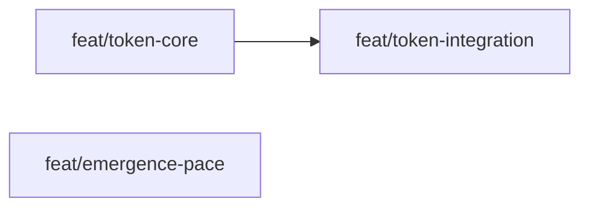

# Approach: Token Usage Logging

## Strategy

Three partitions. Partition 1 builds the core `tokens.py` module and tests. Partition 2 wires it into existing scripts and extends `history.py`. Partition 3 updates the emergence agent prompts with pace selection — it is independent of Partitions 1 and 2 and can run in parallel with Partition 1.

## Partitions (Feature Branches)

### Partition 1: Core Token Logger → `feat/token-core`
**Modules**: `scripts/tokens.py`, `tests/test_tokens.py`
**Scope**: New standalone `tokens.py` module with `init_log()`, `append_entry()`, `load_log()`. Entry schema validation. Unit tests covering: create on first write, append grows list, schema validation rejects bad source, load returns [] on missing/corrupt file.
**Dependencies**: None

#### Implementation Steps
1. Create `src/cicadas/scripts/tokens.py` with `init_log()`, `append_entry()`, `load_log()`
2. Add schema validation in `append_entry()`: validate required fields, validate `source` enum
3. Create `tests/test_tokens.py` with full unit test coverage

### Partition 2: Script Integration + History Rollup → `feat/token-integration`
**Modules**: `scripts/kickoff.py`, `scripts/branch.py`, `scripts/history.py`, `tests/test_tokens.py` (integration tests appended)
**Scope**: Wire `append_entry()` into `kickoff.py` (lifecycle/kickoff boundary) and `branch.py` (implementation/branch-start boundary). Extend `history.py` with `load_token_summary()` helper and token block in the HTML card. Integration tests for kickoff and branch boundary writes. History rendering tests with and without token data.
**Dependencies**: Requires Partition 1 (`feat/token-core`)

#### Implementation Steps
1. Import `append_entry` in `kickoff.py`; call after initiative is registered and active_dir is set
2. Import `append_entry` in `branch.py`; call after branch is registered
3. Add `load_token_summary()` to `history.py`
4. Add conditional token block to `render_html()` card template
5. Add integration tests to `test_tokens.py` (or `test_kickoff.py` / `test_branch.py`)

### Partition 3: Emergence Pace Selection → `feat/emergence-pace`
**Modules**: `emergence/clarify.md`, `emergence/ux.md`, `emergence/tech-design.md`, `emergence/approach.md`, `emergence/tasks.md`, `emergence/EMERGENCE.md`
**Scope**: Add pace question to `clarify.md` step 0 (writes `emergence-config.json`). Add pace-check step to each subsequent emergence agent. Update `EMERGENCE.md` workflow table to document the pace option.
**Dependencies**: None — emergence prompts are independent of the token logging scripts

#### Implementation Steps
1. Update `clarify.md` step 0: present the three-level pace menu, write `emergence-config.json`
2. Update `ux.md`, `tech-design.md`, `approach.md`, `tasks.md`: add step 0 that reads `emergence-config.json` and states the active stop rule for this doc
3. Update `EMERGENCE.md`: add pace option to the workflow overview

## Sequencing

Partitions 1 and 3 can run in parallel. Partition 2 depends on Partition 1.



### Partitions DAG

> This block is machine-readable. It drives automatic worktree creation in `branch.py`.

```yaml partitions
- name: feat/token-core
  modules: [scripts/tokens.py, tests/test_tokens.py]
  depends_on: []

- name: feat/token-integration
  modules: [scripts/kickoff.py, scripts/branch.py, scripts/history.py]
  depends_on: [feat/token-core]

- name: feat/emergence-pace
  modules: [emergence/clarify.md, emergence/ux.md, emergence/tech-design.md, emergence/approach.md, emergence/tasks.md, emergence/EMERGENCE.md]
  depends_on: []
```

## Migrations & Compat

No schema migrations. No existing files are modified in a breaking way. Existing `tokens.json` files (none exist yet) would be additive. Existing archives without `tokens.json` render normally — the token block is simply omitted.

## Risks & Mitigations

| Risk | Mitigation |
|------|------------|
| `append_entry()` raises in a production script | Wrap call in try/except in kickoff.py and branch.py; print [WARN] and continue |
| HTML rendering breaks for old archive entries | Conditional block: only render token section when summary is non-None |

## Alternatives Considered

**Single partition:** Could be done in one `feat/token-logging` branch. Rejected because the core module and the integration work are independently testable and cleanly separable — two partitions improves reviewability and makes the dependency explicit.

**JSONL instead of JSON:** Simpler append but harder to read and requires custom parsing. Initiative logs are small (<50 entries); full JSON rewrite is acceptable and produces prettier output.
