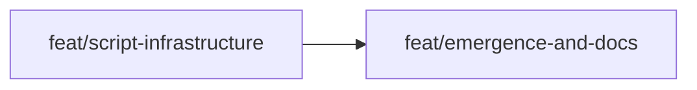

# Approach: skill-builder

## Strategy

Sequential with two phases. Phase 1 builds all Python infrastructure — the thin script changes and two new scripts — and validates them with tests. Phase 2 authors all Markdown instruction modules and documentation updates, referencing the verified CLI contracts from Phase 1. The split is clean: no file is touched by both partitions.

No migrations. No backward-incompatibility. All changes to existing scripts are additive (adding `skill/` to existing prefix conditions).

## Partitions (Feature Branches)

### Partition 1: Script Infrastructure → `feat/script-infrastructure`

**Modules**: `src/cicadas/scripts`, `src/cicadas/templates`

**Scope**: All Python changes and the SKILL.md template scaffold.
- `branch.py` — add `skill/` to lightweight parent-branch selection
- `status.py` — add `skill/` to branch grouping (new "Skills" display section)
- `archive.py` — add `skill/` to branch-type detection
- `prune.py` — add `skill/` to branch-type detection
- `abort.py` — add `"skill/"` to `LIGHTWEIGHT_PREFIXES`
- `scripts/validate_skill.py` — new; Agent Skills spec compliance validator (frontmatter, name, description). Exit 0/1.
- `scripts/skill_publish.py` — new; reads `publish_dir` from `emergence-config.json`, copies or symlinks `active/skill-{name}/` to destination.
- `templates/skill-SKILL.md` — new; minimal SKILL.md scaffold for internal agent use.

**Dependencies**: None — can start immediately.

#### Implementation Steps
1. Add `or name.startswith("skill/")` to the lightweight prefix condition in `branch.py`.
2. Add `skill/` grouping to `status.py` display and branch dict comprehensions.
3. Add `or name.startswith("skill/")` to the branch-type check in `archive.py`.
4. Add `or name.startswith("skill/")` to the branch-type check in `prune.py`.
5. Add `"skill/"` to the `LIGHTWEIGHT_PREFIXES` tuple in `abort.py`.
6. Implement `validate_skill.py`: parse frontmatter with stdlib regex; validate name charset/length/dir-match and description length; exit 0/1 with `[OK]`/`[ERR]` output. Spike multi-line description handling first (see implementation risk below).
7. Implement `skill_publish.py`: read `emergence-config.json` for `publish_dir`; `shutil.copytree` to destination (copy by default, `--symlink` opt-in); safety check for existing destination.
8. Write `templates/skill-SKILL.md` minimal scaffold.
9. Add unit tests for `validate_skill.py` (all violation types) and integration tests for `skill_publish.py` and the five modified scripts. Add `skill/` regression assertions to existing `test_branch.py`, `test_status.py`, `test_archive.py`, `test_prune.py`.

---

### Partition 2: Emergence and Docs → `feat/emergence-and-docs`

**Modules**: `src/cicadas/emergence`, `src/cicadas/SKILL.md`

**Scope**: All Markdown instruction modules and documentation updates.
- `emergence/skill-create.md` — new; dialogue-driven create flow (intent questions, bundling signal detection, draft generation, review loop, write + kickoff + branch + validate).
- `emergence/skill-edit.md` — new; dialogue-driven edit flow (diagnostic question, targeted change, validate).
- `emergence/start-flow.md` — add publish destination step scoped to skill entry type; extend scoping table with `skill` column.
- `SKILL.md` — add **Skills** section under Operations (triggers, create/edit/validate/tune flows, complete skill operation); add `skill/` to branch hierarchy diagram; add skill Builder commands.

**Dependencies**: `feat/script-infrastructure` — emergence modules reference `validate_skill.py` and `skill_publish.py` CLI calls; scripts must be complete and testable before the instruction modules are finalised.

#### Implementation Steps
1. Draft `emergence/skill-create.md`: start flow (publish destination step) → intent dialogue (4 clarifying questions + bundling signal probe) → draft generation instructions (full SKILL.md + proposed bundled files) → review loop → write/kickoff/branch/validate/publish-at-completion sequence.
2. Draft `emergence/skill-edit.md`: diagnostic question → read active skill → targeted edit proposal (before/after) → validate.
3. Update `emergence/start-flow.md`: add publish destination step to the mandatory sequence; scope to skill entry type only; extend scoping table.
4. Update `SKILL.md`: Skills section under Operations; branch hierarchy diagram; Builder commands (`"create a skill"`, `"edit skill X"`, `"tune skill X"`); description triggers.

---

## Sequencing

Partition 1 runs first (parallel-eligible, gets worktree). Partition 2 starts after Partition 1 is merged into `initiative/skill-builder`.



### Partitions DAG

> This block is machine-readable. It drives automatic worktree creation in `branch.py`.

```yaml partitions
- name: feat/script-infrastructure
  modules: [src/cicadas/scripts, src/cicadas/templates]
  depends_on: []                    # parallel — will get a worktree

- name: feat/emergence-and-docs
  modules: [src/cicadas/emergence, src/cicadas/SKILL.md]
  depends_on: [feat/script-infrastructure]   # sequential
```

## Migrations & Compat

None required. All changes to existing scripts are additive — adding `skill/` to existing conditions. No existing behaviour changes. No `.cicadas/` state file schema changes (except the optional `publish_dir` key in `emergence-config.json`, which is backward compatible since it's only read when present).

## Risks & Mitigations

| Risk | Mitigation |
|------|------------|
| Multi-line YAML `description` in `validate_skill.py` regex | Spike with test cases covering block scalars and folded scalars before committing to the regex approach. If unreliable, restrict to single-line or flow scalars and document. |
| `skill_publish.py` overwrites an existing published skill silently | Destination existence check — exit `[ERR]` if `{publish_dir}/{slug}/` already exists; require `--force` to overwrite. |
| `emergence/skill-create.md` references scripts that behave differently than documented | Author Partition 2 after Partition 1 is merged so the instruction module is written against the actual implemented CLI. |
| `status.py` `skills` dict comprehension misses edge cases (e.g. `skill-` initiative vs `skill/` branch) | Add specific test assertions in `test_status.py` covering `skill/` branches alongside `fix/` and `tweak/` branches. |

## Alternatives Considered

**Single partition (all changes in one branch):** Considered. Rejected because mixing Python script changes with Markdown emergence module authoring in one branch makes code review harder and obscures the logical dependency. The two-partition split also allows the instruction modules to be authored against a verified implementation.

**Three partitions (plumbing / new scripts / docs):** Considered. The plumbing changes (5 files, 1–3 lines each) are too small to warrant their own branch. Bundling them with the new scripts in Partition 1 keeps the "all testable code" together.
