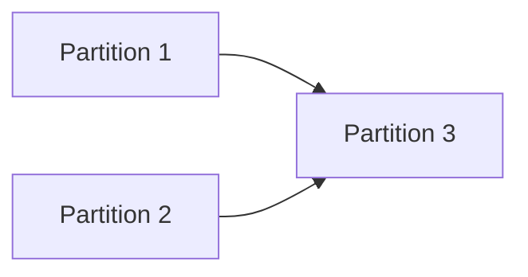

# Approach: {Initiative Name}

## Strategy
{High-level plan: sequential, parallel, phased?}

## Partitions (Feature Branches)

### Partition 1: {Name} → `feat/{branch-name}`
**Modules**: `{module1}`, `{module2}`
**Scope**: {What this partition implements}
**Dependencies**: None / Requires Partition X

#### Implementation Steps
1. {Step 1}
2. {Step 2}

### Partition 2: {Name} → `feat/{branch-name}`
**Modules**: `{module3}`
**Scope**: {What this partition implements}
**Dependencies**: {Dependency description}

#### Implementation Steps
1. {Step 1}
2. {Step 2}

## Sequencing

{Which partitions can run in parallel? Which must be sequential?}



### Partitions DAG

> This block is machine-readable. It drives automatic worktree creation in `branch.py`.
> - `depends_on: []` → partition runs in parallel (gets its own git worktree)
> - `depends_on: [feat/other]` → partition is sequential (plain branch, waits for dependency)
> - Omit this block entirely to fall back to sequential-only behavior (backward compatible).

```yaml partitions
- name: feat/{branch-name-1}
  modules: [{module1}, {module2}]
  depends_on: []                    # parallel — will get a worktree

- name: feat/{branch-name-2}
  modules: [{module3}]
  depends_on: []                    # also parallel

- name: feat/{branch-name-3}
  modules: [{module4}]
  depends_on: [feat/{branch-name-1}, feat/{branch-name-2}]   # sequential
```

## Migrations & Compat
{How to handle existing data/users without downtime}

## Risks & Mitigations
| Risk | Mitigation |
|------|------------|
| {Risk} | {Mitigation} |

## Alternatives Considered
{Why we didn't do something else}
